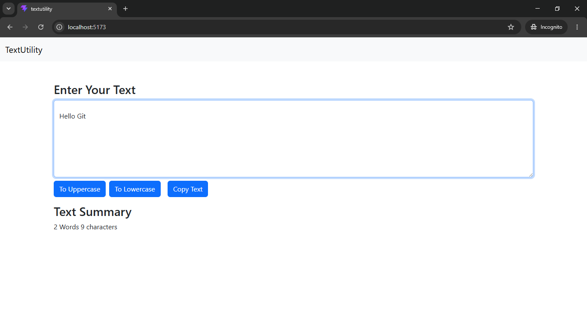

# TextUtility

A simple and beginner-friendly text manipulation application built with **React** and **Vite**.

## 🚀 Features

- Convert text to **UPPERCASE**
- Convert text to **lowercase**
- Copy text to clipboard
- Display word count
- Clean and responsive user interface

## 📸 Project Screenshot




## 🛠️ Built With

- React
- Vite
- JavaScript
- HTML5
- CSS3
- Bootstrap


## ⚙️ Installation

1. Clone the repository

```bash
git clone https://github.com/avinashmunjapara/Text-Utility.git
```

2. Navigate to the project folder

```bash
cd textutility
```

3. Install dependencies

```bash
npm install
```

4. Start the development server

```bash
npm run dev
```

5. Open your browser and visit

```bash
http://localhost:5173
```

## 📖 How to Use

1. Enter text in the textarea.
2. Click **To Uppercase** to convert text into uppercase.
3. Click **To Lowercase** to convert text into lowercase.
4. Click **Copy Text** to copy the text to your clipboard.
5. View the word and character count in the Text Summary section.

## 🎯 Learning Objectives

This project was created to practice:

- React Components
- Props
- Event Handling
- State Management using `useState`
- Clipboard API
- Vite Project Setup


## 👨‍💻 Author

**Avinash Munjapara**

GitHub: https://github.com/avinashmunjapara

---

⭐ If you like this project, don't forget to give it a star!